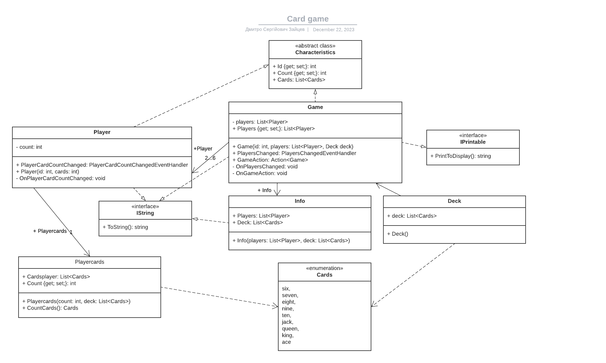

# Card Game

## Class descriptions:
- **Game:** - stores all information about the game
- **Player:** - set the id and number of cards
- **Playercards:** - deck generation
- **Info:** - creating information about the outcome of the game
- **Deck:** - generating deck
